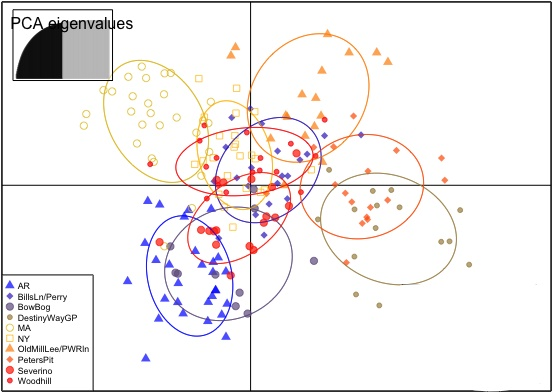

# Gen711 Final Project- Prairie Warbler Populations
## Background
We chose to examine the population structure of 195 Prairies Warblers at 10 different sites. This project was of interest, as two members of the group, Alexa Aubrey and Brighid Lamprey, work as undergraduate researchers in Adrienne Kovach's lab, examining Prairie Warbler populations. This is a study of importance as Prairie Wrabler populations are declining due to habitat destruction, so there is a need for conservation (Wilson 2010). A key aspect of conservation efforts is to identify whether different populations can be managed as one or if they should be managed separately, which can be determined by examining genetic diversity amongst populations at different sites (Kovach 2018). In this abbreviated study, the sites we chose to examine were six local New Hampshire sites (Bow Bog, Destiny Way Gravel pit, Old Mill Lee Power Line, Peter's Gravel pit, Severino, and Woodhill), and one site from Maine (Bills Lane/Perry Oliver), Massachusetts, New York, and Arkansas. The sites were selectively chosen as they represent the location of Prairie Warbler populations within our home states, with Arkansas as an outlier to examine if there was increased genetic diversity based on geographical distance (Kovach 2018). The samples used were collected from collaborators and from Kovach's lab where they underwent DNA extraction and PCR amplification with 11 different microsatellites. From the data collected, a Discriminate Analysis of Principal Components (DAPC) and an Isolation By Distance with Mantel test were run. The DAPC was performed to explore the structure of Prarie Warbler populations without making assumptions of Panmixia (random mating) and the Isolation by Distance was performed to determine correlation between genetic distance and geographic distance, which was represented by a slope value.

## Methods
Blood samples were taken from Prairie Warblers at multiple sampling sites. PCR products of microsatellite loci were analyzed using fragment analysis. Alleles were scored using PeakScanner​ and entered into Google Sheets. Calls were binned using analysis completed independently by Melissa Bauer, Alexa Aubrey, and Brighid Lamprey. R Console/RStudio and the ‘adegenet’ package were installed. A structure file was created to determine the number of PCAs and DAs to keep. A DAPC was run. The structure file was used to create a genetic distance matrix. A Mantel Test was run and an IBD plot was created. When running the IBD script there was an error....

## Findings
 

Figure 1. DAPC (Discriminate Analysis of Principal Components) visualizing genetic variation among sampled locations. The PCA indicates the variance trend to avoid under and overfitting. Symbols on the plot correspond to unique sample sites. The plot indicates little spatial patterns. The plot reveals similarity between the BowBog (a NH site) and Arkansas (AR) site, and similarities between the two gravel pit sites. Massachusetts was show to be isolated from other states, compared to New York (NY) which was in the middle of the plot showing similarities to New Hampshire (NH) and Maine (ME). 

Figure 2. Resulting from a Cross Validation. This is a procedure in which a certain amount of data is left out, a DAPC is run and then see if the data that was left out can be correctly placed into the population.

Figure 3. A zoomed in cross validation looking specfically at 90 to 110.

Figure 4. Isolation by Distance test against genetic distance and geographic distance for 9 out of the 10 Prairie Warbler Sites. Arkansas (AR) was dropped from this test since it was the geographic outlier. With a R-value of -0.3101 and a p-value of 0.872 there was no significant correlation observed. The lack of signficant correlation indicated that the genetic makeup of these populations were not impacted by their distance from each other. 

## Conclusion
Due to the clustering pattern of shown on the DAPC we see that there is a high genetic diversity between populations. As seen in the Isolation by Distance, we can tell that the genetic variation is not due to geographic distance since the P-value is high and the Correlation Coefficient is negative, supporting that the populations can be treated and managed as one.

## Citations 
Wilson, A. G., Arcese, P., Chan, Y. L., & Patten, M. A. (2010). Micro-spatial genetic structure in song sparrows (Melospiza melodia). Conservation Genetics, 12(1), 213–222. https://doi.org/10.1007/s10592-010-0134-4

Rare Book Division, the New York Public Library. “110. The Prairie Warbler (Sylvicola discolor). 111. The Black-throated Bunting (Emberiza americana).” The New York Public Library Digital Collections. 1842-1844. 

High Throughput Method for Analysis of Repeat Number for 28 Phase Variable Loci of Campylobacter jejuni Strain NCTC11168 - Scientific Figure on ResearchGate. Available from: https://www.researchgate.net/figure/Analysis-of-multiplex-fragment-analysis-data-in-PeakScanner-A-PeakScanner-application_fig1_305711309 [accessed 2 May, 2022] 

Acknowledgments: Stephanie Copland, Katie Shink, Melissa Bauer, Logan Maxwell, Adrienne Kovach, Matthew Tarr, Mike Akresh,  and Neil Gifford

(Kovach and Tarr, 2018). https://extension.unh.edu/sites/default/files/migrated_unmanaged_files/Resource007340_Rep10568.pdf

## Presentation 
A google slides was made. https://docs.google.com/presentation/d/1kYWnE1YqCtpR69xZNnRSPwhJhXa4fu4M5RyhJn1ACWA/edit#slide=id.p 
