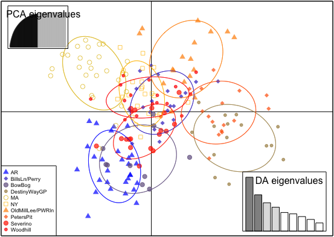
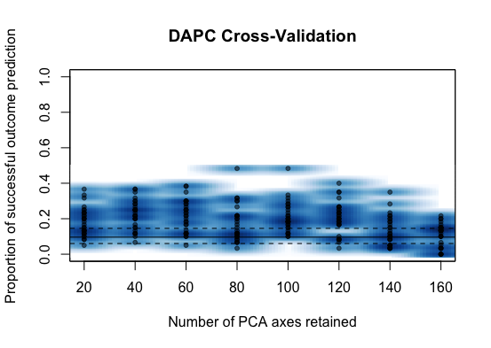
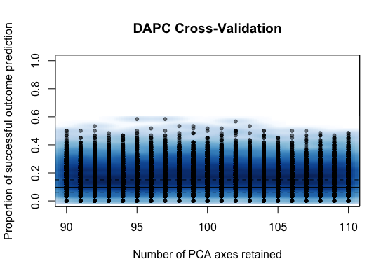
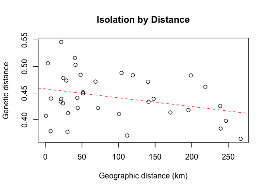

# Gen711 Final Project- Prairie Warbler Populations
## Background
We chose to examine the population structure of 195 Prairies Warblers at 10 different sites. This project was of interest, as two members of the group-- Alexa Aubrey and Brighid Lamprey-- work as Undergraduate researchers in Adrienne Kovach's lab, examining Prairie Warbler populations. This is a study of importance as Prairie Wrabler populations are declining due to habitat destruction, so there is a need for conservation. A key aspect of conservation efforts is to identify whether different populations can be managed as one or if they should be managed separately, which can be determined by examining genetic diversity amongst populations at different sites. In this abbreviated study, the sites we chose to examine were six local New Hampshire sites (Bow Bog, Destiny Way Gravel pit, Old Mill Lee Power Line, Peter's Gravel pit, Severino, and Woodhill), and one site from Maine (Bills Lane/Perry Oliver), Massachusetts, New York, and Arkansas. The sites were selectively chosen as they represent the location of Prairie Warbler populations within our home states, with Arkansas as an outlier to examine if there was increased genetic diversity based on geographical distance. The samples used were collected from collaborators and from Kovach's lab where they underwent DNA extraction and PCR amplification with 11 different microsatellites. From the data collected, a Discriminate Analysis of Principal Components (DAPC) and an Isolation By Distance with Mantel test were run. The DAPC was performed to explore the structure of Prarie Warbler populations without making assumptions of Panmixia (random mating) and the Isolation by Distance was performed to determine correlation between genetic distance and geographic distance, which was represented by a slope value.

## Methods
put bioinformatic analysis here. peak scanner binning process into excel usd for structure.
what programs we installed with the conda environment?
how we ran the analysis?
issues?

## Findings
 

Figure 1. DAPC (Discriminate Analysis of Principal Components) visualizing genetic variation among sampled locations. Symbols correspond to unique sample sites. The plot indicates little spatial patterns.

Figure 2. ALEXA

Figure 3. ALEXA

Figure 4. ALEXA

### Conclusion

### presentation 
a google slides was made 
